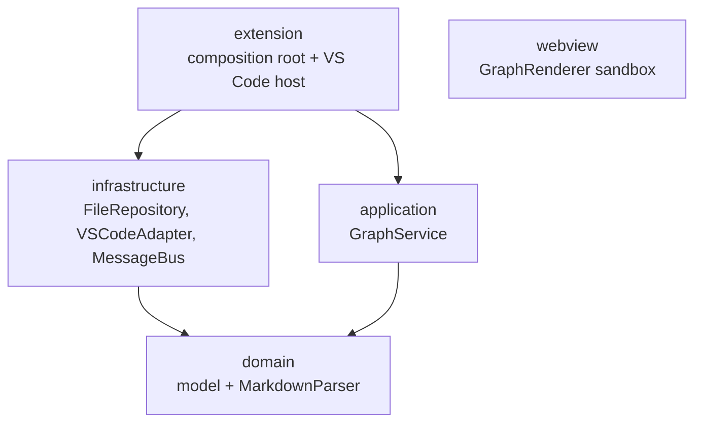
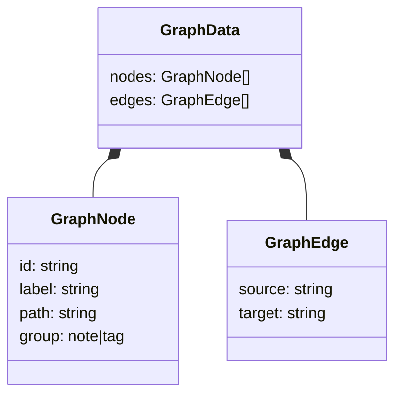

# Software Architecture

## Layering

Dependencies point inward; the domain depends on nothing.

## Modules

| Module | Responsibility | Depends on |
|---|---|---|
| `src/domain` | Graph model, `LinkExtractor`, pure transforms | nothing |
| `src/application` | `GraphService`, `FileRepository` port | domain |
| `src/infrastructure` | `VSCodeFileRepository`, `VSCodeAdapter` | domain, vscode |
| `src/extension` | activation, `GraphPanel`, composition root | all |
| `src/webview` | `GraphRenderer` (d3-force on canvas), search overlay | none (sandbox) |

## Design Patterns

- **Message bus / Command** — host↔webview communication.
- **Observer** — file watcher → re-index → re-render.
- **Repository** — `FileRepository` abstracts workspace file access.
- **Adapter** — `VSCodeAdapter` wraps `vscode.*` for testability.
- **Strategy** — one `LinkExtractor` per link type.
- **Dependency injection** — constructor injection, wired in the composition root.

## Principles

- Pure, VSCode-free domain core (zero framework imports).
- Single responsibility per layer/module.
- Plain data model (`GraphData`) as the single source of truth.
- Fail fast and loud.
- Least privilege (webview sandbox, strict CSP).
- DRY / YAGNI; composition over inheritance.

## Key Types

