# Functional Specification (FSD) — Atlas

## 1. Document Control

| | |
|---|---|
| Author | Mehrdad |
| Status | accepted |
| Version | 1.0.91 |
| Created | 2026-09-26 |
| Updated | 2026-09-26 |

## 2. Introduction & Purpose

Atlas is a VS Code extension that renders a live, Obsidian-style
force-directed graph of the Markdown notes in the current workspace. This FSD
defines the functional requirements the extension must satisfy.

## 3. Scope

**In scope:**
- Discover and parse Markdown notes in the workspace.
- Render an interactive force-directed graph in a webview.
- Node dragging, hover/click highlight, zoom/pan.
- Open a note from the graph.
- Search notes by name and focus a result.

**Out of scope:**
- Editing notes inside the graph.
- Syncing or external backends.
- Note content search beyond link extraction.

## 4. Definitions & Acronyms

| Term | Meaning |
|---|---|
| Node | A note or tag shown in the graph. |
| Edge | A link between two nodes. |
| Wikilink | `[[Note]]` syntax. |
| Webview | VS Code's sandboxed HTML/JS view. |
| GraphData | Plain JSON model shipped to the webview. |

## 5. System Overview

The extension host reads Markdown, parses links, builds a graph index, and posts
`GraphData` to the webview, which renders it with `d3-force`. See
[[System Architecture]].

## 6. Actors & User Roles

- **User** — the person using VS Code, interacting with the graph.

## 7. Functional Requirements

### FR-1 [[Graph Rendering]]
1. **Requirements & Specification** — Render notes/tags as nodes and links as edges on a canvas; links always visible.
2. **UI Design** — Canvas fills the webview; notes colored by folder, tags orange.
3. **System Design — DFD**
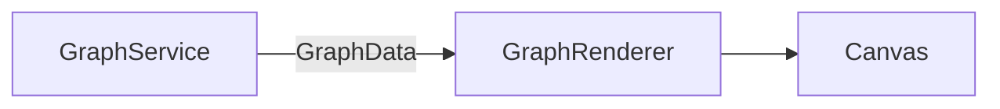
4. **Workflow Diagram**
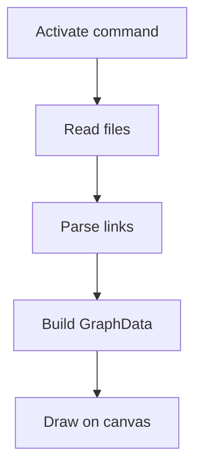
5. **Data Model & Message Contracts** — `GraphData { nodes, edges }`.
6. **Validation** — Skip unreadable/malformed files; render even when a single file fails.
7. **Exception Handling** — Missing canvas context throws immediately.

### FR-2 [[Link Parsing]]
1. **Requirements & Specification** — Extract `[[wikilinks]]`, `#tags`, and `[label](target)` links.
2. **UI Design** — Tags appear as distinct orange nodes.
3. **System Design — DFD**
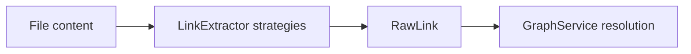
4. **Workflow Diagram**
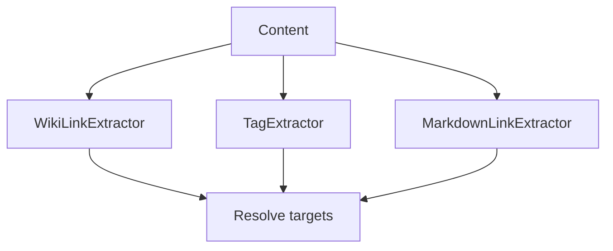
5. **Data Model & Message Contracts** — `RawLink { source, target }` → `GraphEdge { source, target }`.
6. **Validation** — Targets resolved by id, then basename; unresolved links become nodes.
7. **Exception Handling** — Regex must not throw on unusual input; unmatched links are ignored.

### FR-3 [[Drag to Rearrange]]
1. **Requirements & Specification** — Dragging a node pins it and re-arranges its neighborhood; release settles it.
2. **UI Design** — Pointer follows the node; neighbors flow around it.
3. **System Design — DFD**
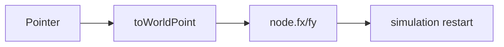
4. **Workflow Diagram**
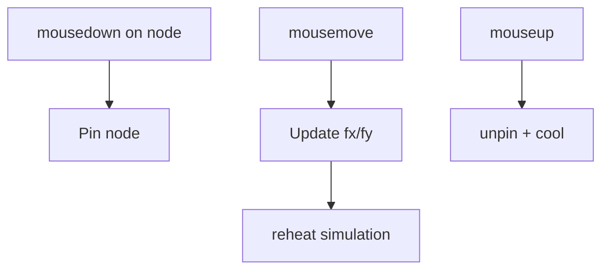
5. **Data Model & Message Contracts** — Uses `SimulationNodeDatum.fx/fy`.
6. **Validation** — Hit-test radius scales with node size and zoom.
7. **Exception Handling** — Guard against `x`/`y` being non-numeric during drag.

### FR-4 [[Hover Highlight]]
1. **Requirements & Specification** — Hovering highlights a node (purple) and its neighbors; dims the rest.
2. **UI Design** — Active node + label purple; non-neighbors at low alpha.
3. **System Design — DFD**
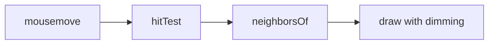
4. **Workflow Diagram**
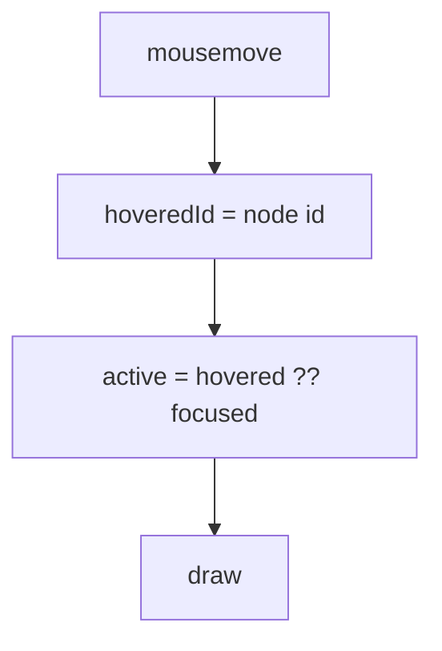
5. **Data Model & Message Contracts** — `hoveredId`, `neighborsOf(id) → Set<string>`.
6. **Validation** — Hover cleared when the pointer leaves a node.
7. **Exception Handling** — None; transient state only.

### FR-5 [[Click to Focus]]
1. **Requirements & Specification** — Clicking a node persists its highlight until another node or empty space is clicked.
2. **UI Design** — Same highlight treatment as hover, but persistent.
3. **System Design — DFD**
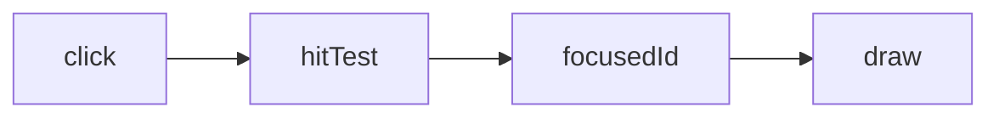
4. **Workflow Diagram**
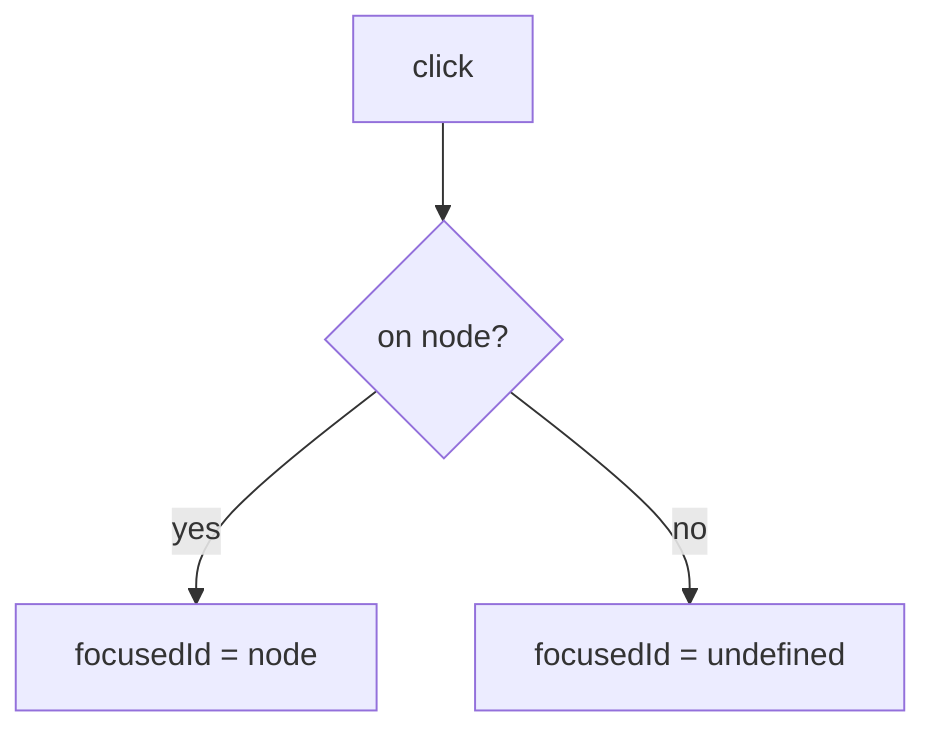
5. **Data Model & Message Contracts** — `focusedId`.
6. **Validation** — Drags (`didDrag`) must not trigger focus.
7. **Exception Handling** — None; persistent state cleared on empty click.

### FR-6 [[Double-click to Open]]
1. **Requirements & Specification** — Double-clicking a node opens its note in a new editor tab, in the other split (splitting first if needed).
2. **UI Design** — No visual change; the note opens beside the graph.
3. **System Design — DFD**
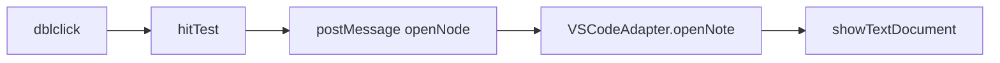
4. **Workflow Diagram**
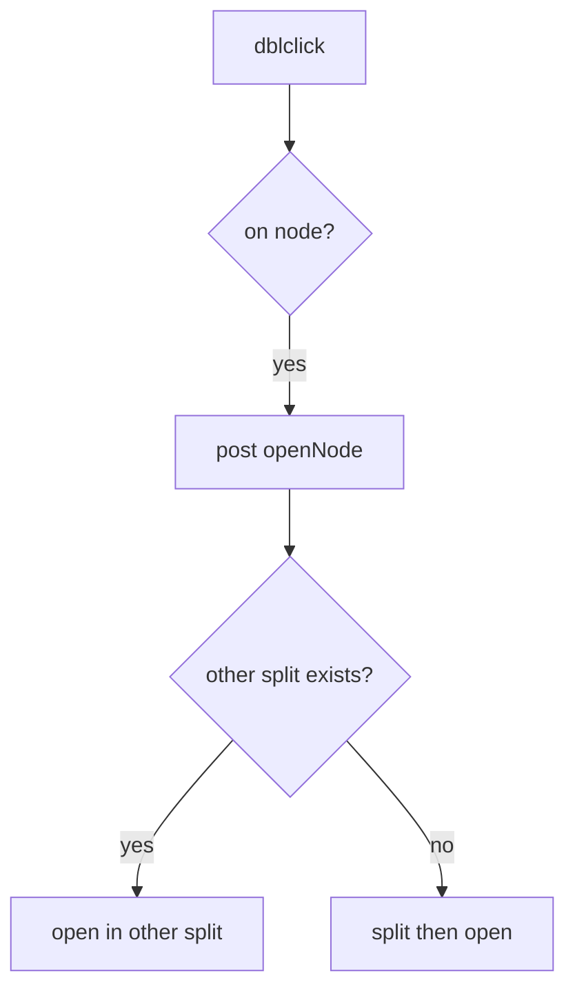
5. **Data Model & Message Contracts** — `{ type: "openNode", path }`.
6. **Validation** — Only nodes with a non-empty `path` open.
7. **Exception Handling** — Missing path is a no-op.

### FR-7 [[Zoom and Pan]]
1. **Requirements & Specification** — Wheel zooms toward the cursor (0.2x–4x); dragging the background pans.
2. **UI Design** — Links and outlines stay ~1px; labels stay constant screen size.
3. **System Design — DFD**
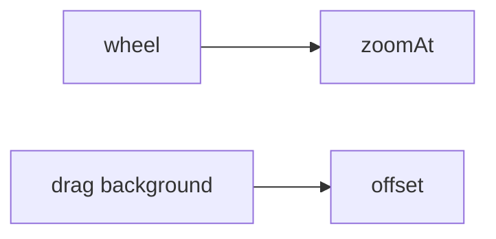
4. **Workflow Diagram**
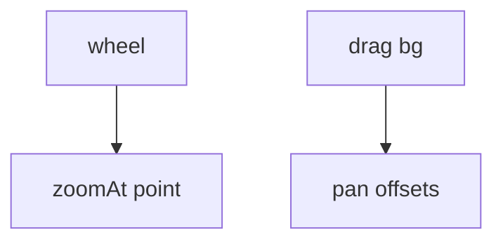
5. **Data Model & Message Contracts** — `scale`, `offsetX`, `offsetY`.
6. **Validation** — Scale clamped to [0.2, 4]; zoom-at-point keeps cursor fixed.
7. **Exception Handling** — Clamp prevents NaN/degenerate scale.

### FR-8 [[Degree-based Node Sizing]]
1. **Requirements & Specification** — Node radius scales with connection count via min-max normalization (notes 8–18px, tags 5–13px).
2. **UI Design** — More-connected nodes are larger; bounded so no node balloons.
3. **System Design — DFD**
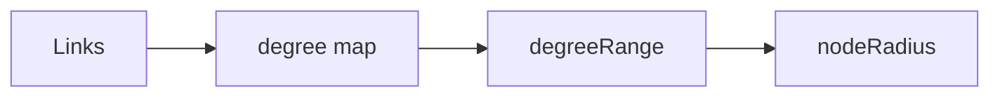
4. **Workflow Diagram**
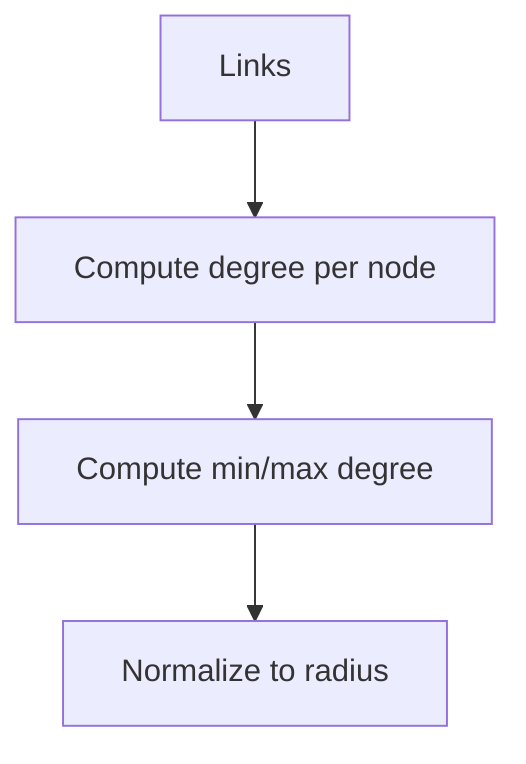
5. **Data Model & Message Contracts** — `node.degree`, `degreeRange { minDegree, maxDegree }`.
6. **Validation** — Division by zero guarded when min == max degree.
7. **Exception Handling** — Empty graph yields min radius.

### FR-9 [[Live Refresh]]
1. **Requirements & Specification** — File create/change/delete re-indexes the graph (debounced 500ms).
2. **UI Design** — Graph updates without manual reload.
3. **System Design — DFD**
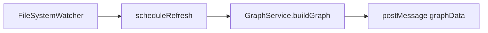
4. **Workflow Diagram**
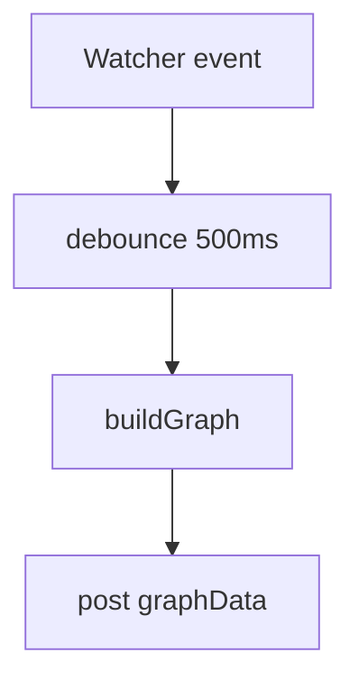
5. **Data Model & Message Contracts** — `{ type: "graphData", data }`.
6. **Validation** — Debounce coalesces rapid edits.
7. **Exception Handling** — Errors surface in the host; watcher stays active.

### FR-10 [[Theme Awareness]]
1. **Requirements & Specification** — All colors come from VS Code theme CSS variables.
2. **UI Design** — Graph adapts to light/dark/any theme automatically.
3. **System Design — DFD**
```mermaid
flowchart LR
    A[VS Code theme] --> B[CSS variables]
    B --> C[cssVar()]
    C --> D[draw]
```
4. **Workflow Diagram**
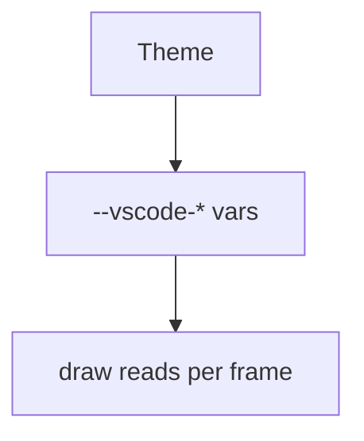
5. **Data Model & Message Contracts** — No data; reads `getComputedStyle` per frame.
6. **Validation** — Falls back to sensible defaults when a variable is empty.
7. **Exception Handling** — None; fallback colors prevent invisible output.

### FR-11 [[Version Badge]]
1. **Requirements & Specification** — Show the extension version in the top-right corner.
2. **UI Design** — Subtle, non-interactive overlay.
3. **System Design — DFD**
```mermaid
flowchart LR
    A[package.json version] --> B[activation]
    B --> C[GraphPanel]
    C --> D[HTML overlay]
```
4. **Workflow Diagram**
```mermaid
flowchart TD
    V[context.extension.packageJSON.version] --> H[inject into webview HTML]
```
5. **Data Model & Message Contracts** — String injected into HTML, not a message.
6. **Validation** — Version is valid semver.
7. **Exception Handling** — Missing version renders empty badge.

### FR-12 [[Folder Clustering]]
1. **Requirements & Specification** — Group notes by their top-level folder using a soft cluster force so unlinked files gather together; dragging stays unrestricted.
2. **UI Design** — Each folder is tinted a distinct color; a translucent convex-hull blob is drawn behind each cluster.
3. **System Design — DFD**
```mermaid
flowchart LR
    A[Folder key] --> B[Cluster assignment]
    B --> C[forceCluster]
    C --> D[Node positions]
    D --> E[Blob + node color]
```
4. **Workflow Diagram**
```mermaid
flowchart TD
    N[Nodes] --> K[clusterKeyOf]
    K --> G[Group by top-level folder]
    G --> F[forceCluster pulls to centroid]
    F --> B[Draw convex-hull blob + folder color]
```
5. **Data Model & Message Contracts** — `node.cluster`, `node.color`, `clusters[]`.
6. **Validation** — Clusters with 1–2 nodes fall back to a circle blob; degenerate hulls handled.
7. **Exception Handling** — Non-numeric positions are skipped.

### FR-13 [[Note Search]]
1. **Requirements & Specification** — A rounded search box sits left of the version badge (opacity 0.7, full on focus); typing filters notes by display name (case-insensitive substring). Results list notes as `name — folder`. Enter or the search icon triggers selection; Up/Down navigate.
2. **UI Design** — Search field + dropdown beneath it; folder shown dimmed; the active result is highlighted; hovering/arrowing previews a node without focusing.
3. **System Design — DFD**
```mermaid
flowchart LR
    A[Search input] --> B[performSearch]
    B --> C[nodes filter]
    C --> D[result list]
    D --> E[selectSearchResult]
    E --> F[focusNode]
```
4. **Workflow Diagram**
```mermaid
flowchart TD
    I[input / icon] --> S[performSearch]
    S --> M{matches?}
    M -->|no| E[No results]
    M -->|yes| L[render name - folder]
    L --> H[arrow / hover]
    H --> P[previewId highlight]
    H --> C[enter / click]
    C --> F[focusNode + center]
```
5. **Data Model & Message Contracts** — `searchMatches: GraphNode[]`, `searchIndex`, `previewId`; no new host↔webview messages.
6. **Validation** — Query trimmed and lowercased; results capped at 50; empty query hides the list.
7. **Exception Handling** — No matches shows a "No results" row; `previewId` is cleared on leave/select.

## 8. Data Requirements & Entities

- `GraphData { nodes: GraphNode[], edges: GraphEdge[] }` — see [[Software Architecture]].
- `MarkdownFile { id, label, path, content }` — workspace file read model.

## 9. External Interfaces

- VS Code API: `workspace.findFiles`, `workspace.fs`, `createFileSystemWatcher`,
  `window.showTextDocument`, `window.tabGroups`.
- Webview `postMessage` bridge.

## 10. Assumptions & Dependencies

- The user has a workspace folder open containing Markdown files.
- VS Code `>= 1.85.0`.
- `d3-force` is bundled at build time.

## 11. Acceptance Criteria

- The command `Atlas: Show Graph` opens a graph of the workspace's notes.
- Wikilinks, tags, and Markdown links appear as edges.
- Dragging, hover, click-focus, double-click open, zoom, and pan behave as specified.
- File changes refresh the graph without reload.
- The graph follows the active theme and shows the version badge.
- Searching a note name lists matches (with folder) and selecting one focuses it.
