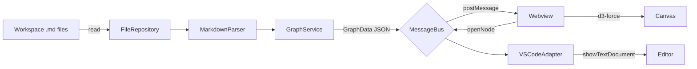

# System Architecture

## Overview

Atlas is a VS Code extension that runs across two processes:

1. **Extension host** (Node.js) — discovers and reads the workspace's Markdown
   files, parses links, and builds a graph index.
2. **Webview** (isolated browser sandbox) — renders the graph on a `<canvas>`
   with `d3-force` and handles all interaction.

The two processes communicate over a typed message bus using plain JSON.

## Data Flow

## Components

| Component | Responsibility |
|---|---|
| `FileRepository` | Glob and read `.md` files in the workspace. |
| `MarkdownParser` / `LinkExtractor` | Extract wikilinks, tags, and Markdown links. |
| `GraphService` | Resolve links to nodes/edges; build `GraphData`. |
| `MessageBus` | Typed `{type, payload}` messages between host and webview. |
| `VSCodeAdapter` | Open notes in the editor (thin wrapper over `vscode`). |
| `GraphRenderer` | d3-force simulation drawn on canvas in the webview. |

## Deployment Shape

- Packaged as a `.vsix`, installed into VS Code.
- Runs entirely locally; no external services or network access.
- `d3-force` is bundled into the webview script at build time; no runtime
  `node_modules` are required in the extension host.
