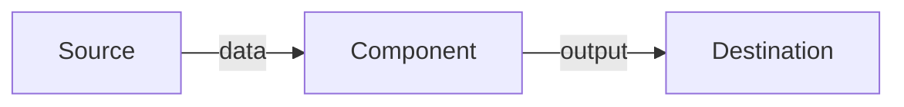
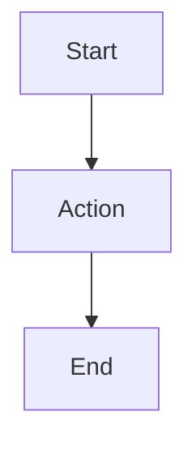
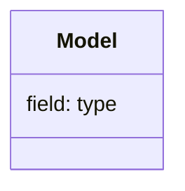

# <Feature Name>

## Requirements & Specification
<What the feature must do.>

## UI Design
<How the feature appears and is interacted with.>

## System Design — DFD

## Workflow Diagram

## Data Model & Message Contracts

## Validation
<Input/state checks and their outcomes.>

## Exception Handling
<How failures are surfaced and recovered from.>
